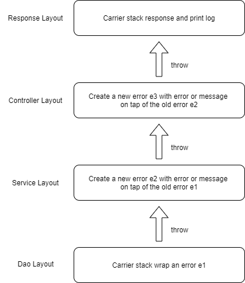

# errors

An errors package optimized for the pkg/errors package

## Use

Download and install

```shell
go get github.com/dobyte/errors
```

## API

```go
// New Wrapping for errors.New standard library
func New(msg string) error

// Is Wrapping for errors.Is standard library
func Is(err, target error) bool

// As Wrapping for errors.As standard library
func As(err error, target interface{}) bool

// Unwrap Wrapping for errors.Unwrap standard library
func Unwrap(err error) error

// WrapMessage Wrap a new error with message and stack.
func WrapMessage(message string) error

// WrapError Wrap a new error with error and stack.
func WrapError(err error) error

// WithMessage Create a new error with message on top of the original error.
func WithMessage(cause error, message string) error

// WithError Create a new error with error on top of the original error.
func WithError(cause, err error) error

// Cause Recursively find the root cause of the error
func Cause(err error) error
```

## Error Build Mode



## Demo

```go
package main

import (
    "fmt"
    
    "github.com/dobyte/errors"
)

func main() {
    if err := controller(); err != nil {
        fmt.Println(err)
        fmt.Printf("%+v\n", err)
    }
}

func controller() error {
    if err := service(); err != nil {
        return errors.WithMessage(err, "controller failed")
    }
    
    return nil
}

func service() error {
    if err := dao(); err != nil {
        return errors.WithError(err, errors.New("service failed"))
    }
    
    return nil
}

func dao() error {
    return errors.WrapMessage("dao failed")
}
```

## Example
View demo [example/main.go](example/main.go)

## References
- [github.com/pkg/errors](github.com/pkg/errors)
- [golang.org/x/tools/cmd/stringer](golang.org/x/tools/cmd/stringer)